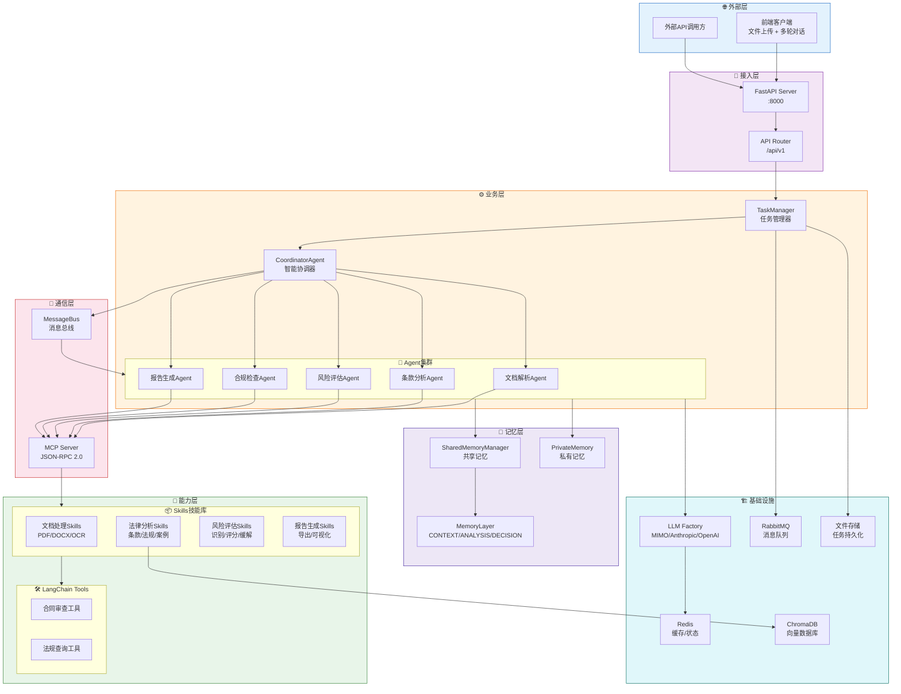

# 智能合同审查系统 - 技术架构文档

## 1. 系统总览

## 2. 文档导航

| 文档 | 说明 |
|------|------|
| [system-architecture.md](./system-architecture.md) | 系统架构详解 - 分层架构、技术栈、模块关系 |
| [agent-workflow.md](./agent-workflow.md) | Agent工作流 - 多Agent协作、消息通信、任务调度 |
| [data-model.md](./data-model.md) | 数据模型 - 记忆层次、共享记忆、数据流 |
| [infrastructure.md](./infrastructure.md) | 基础设施 - LLM、Redis、RabbitMQ、ChromaDB |

## 3. 核心设计原则

### 3.1 多Agent协作
- **职责分离**: 每个Agent专注一个领域（解析、条款、风险、合规、报告）
- **LLM驱动**: 所有Agent使用LLM进行智能分析，正则作为回退
- **动态调度**: CoordinatorAgent通过LLM智能决策任务执行顺序

### 3.2 分层记忆
- **CONTEXT层**: 合同上下文（原始文档、结构化条款、元数据）
- **ANALYSIS层**: 分析结果（条款分析、风险评估、合规检查）
- **DECISION层**: 决策历史（审查决策、冲突解决、最终建议）

### 3.3 可扩展性
- **Skills热插拔**: 通过SkillRegistry动态注册/注销技能
- **Agent可插拔**: 通过CoordinatorAgent动态注册Agent
- **MCP协议**: 标准化的工具通信协议

## 4. 技术栈速览

| 层级 | 技术 | 用途 |
|------|------|------|
| LLM | MIMO模型 (ChatAnthropic) | 智能分析和决策 |
| Agent框架 | LangChain + 自定义BaseAgent | Agent编排和协作 |
| API | FastAPI | RESTful接口 |
| 消息队列 | RabbitMQ | 异步任务处理 |
| 缓存 | Redis | 状态缓存 |
| 向量数据库 | ChromaDB | 法规知识检索 |
| 通信协议 | MCP (JSON-RPC 2.0) | 工具通信 |
