# Agent 工作流与通信

## 1. 多Agent协作流程

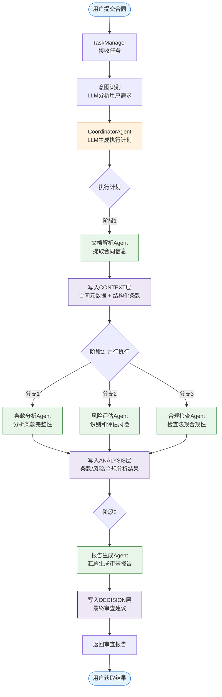

## 2. CoordinatorAgent 智能调度

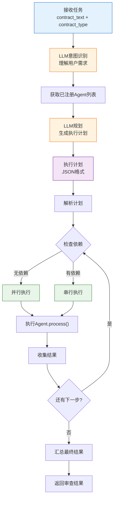

## 3. 消息总线通信

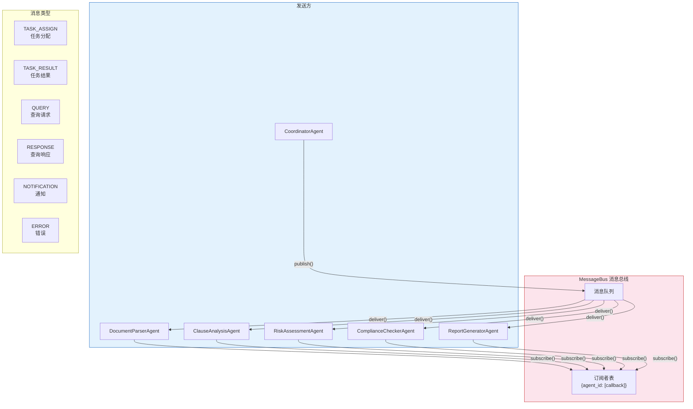

## 4. AgentMessage 数据结构

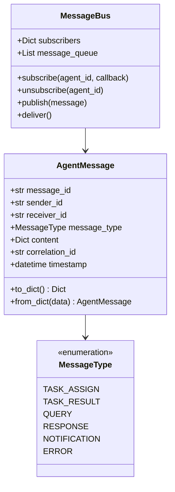

## 5. 各Agent职责与输入输出

### 5.1 DocumentParserAgent（文档解析Agent）

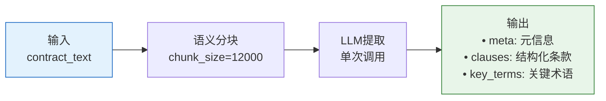

### 5.2 ClauseAnalysisAgent（条款分析Agent）

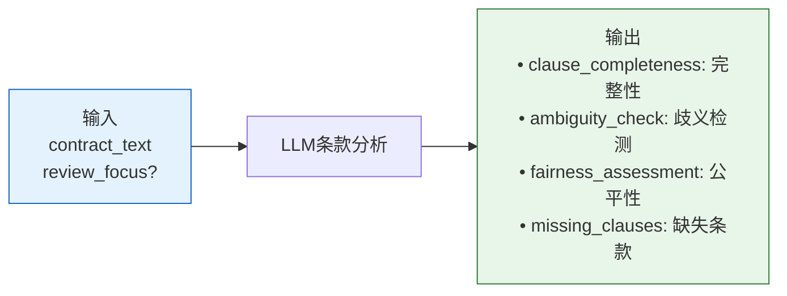

### 5.3 RiskAssessmentAgent（风险评估Agent）

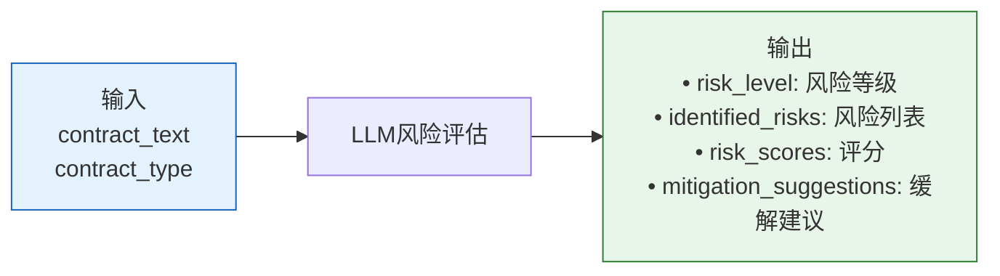

### 5.4 ComplianceCheckerAgent（合规检查Agent）

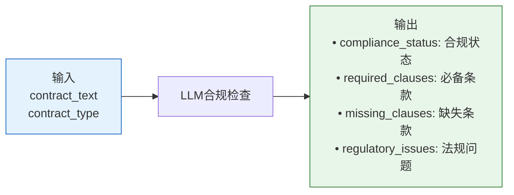

### 5.5 ReportGeneratorAgent（报告生成Agent）

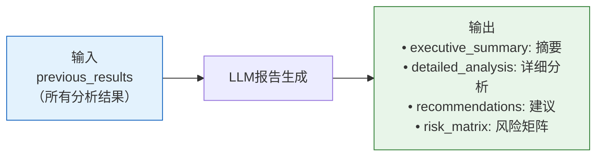

## 6. 异步任务处理

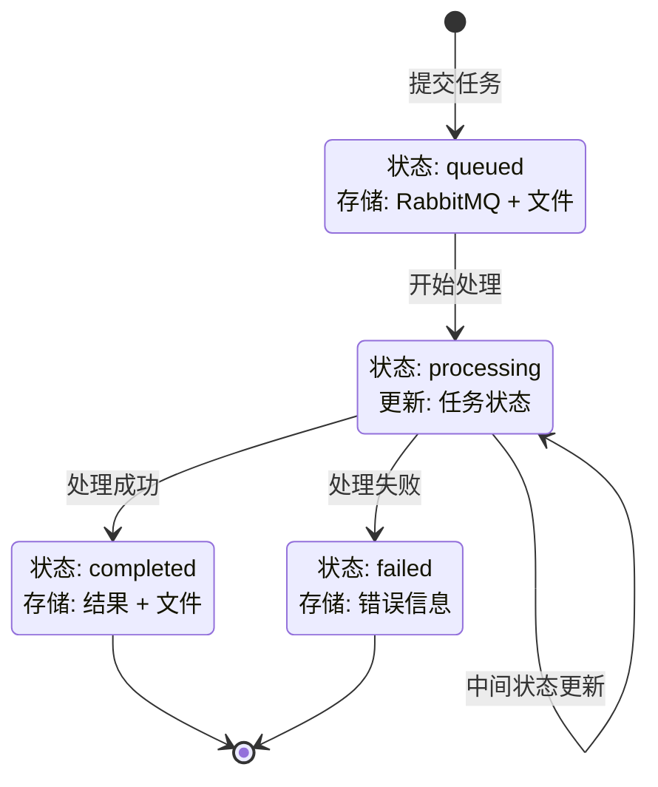

## 7. 错误处理与重试机制

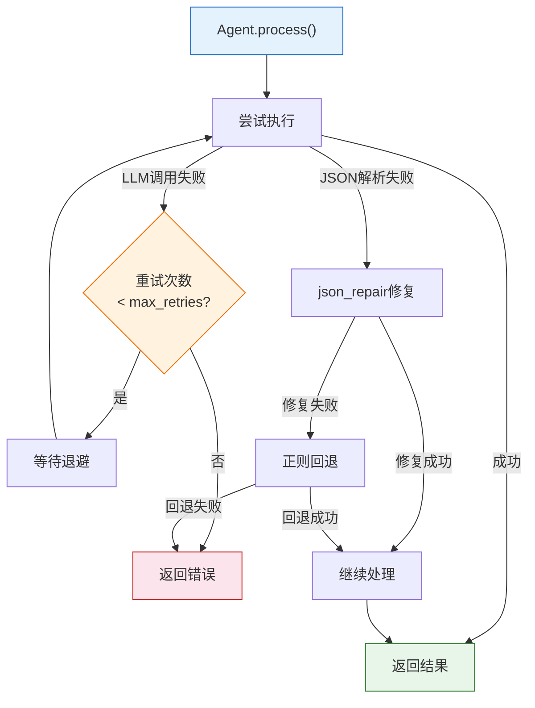
