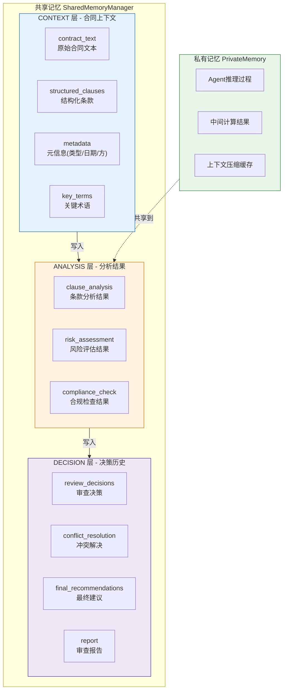
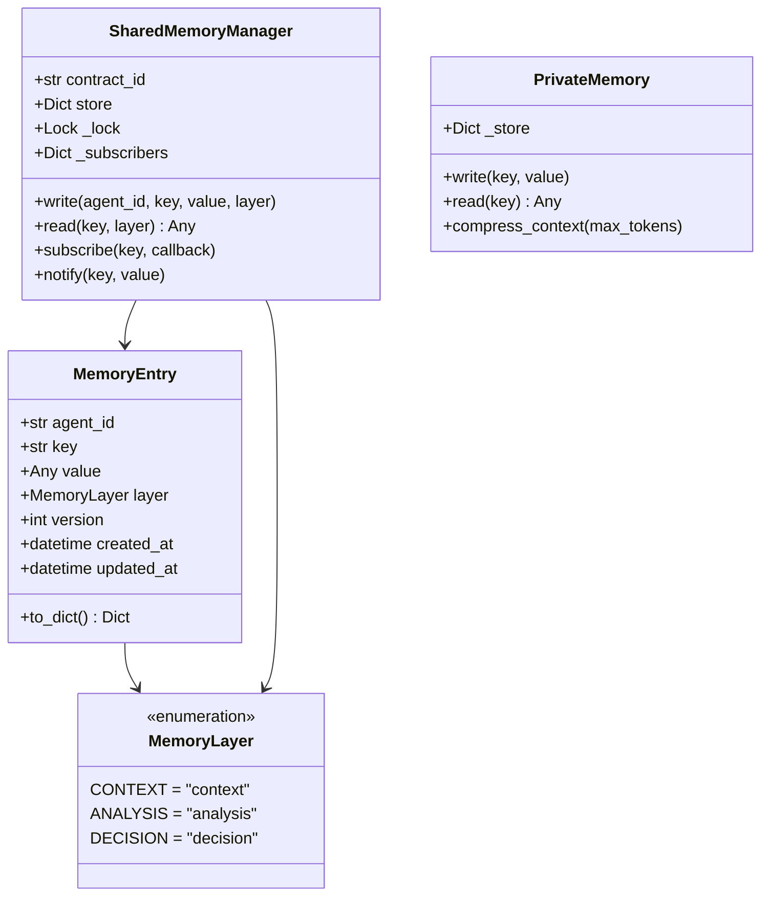
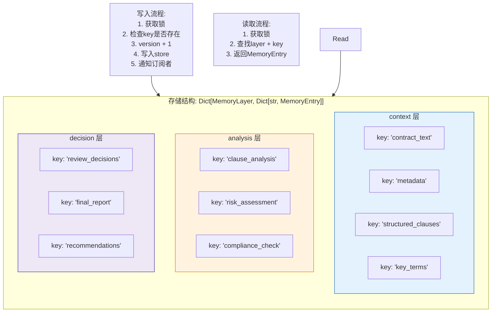
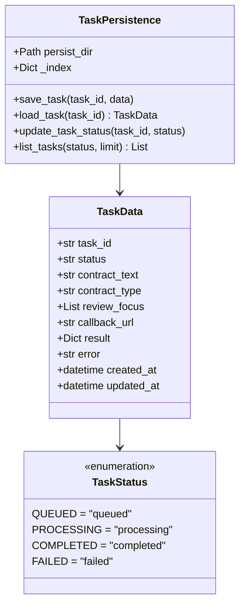
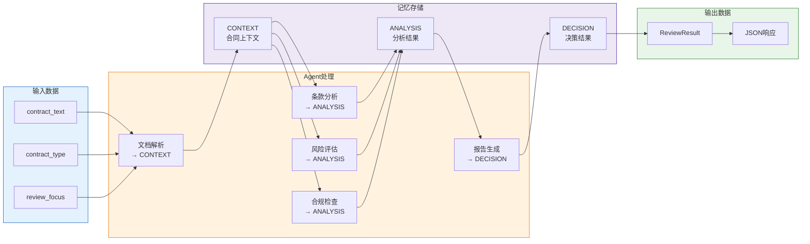
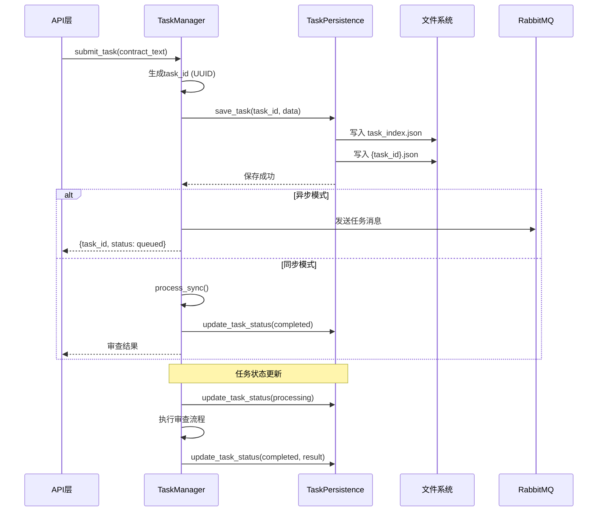

# 数据模型与记忆结构

## 1. 三层记忆架构

```mermaid
graph TB
    subgraph SharedMemory["共享记忆 SharedMemoryManager"]
        direction TB
        subgraph L1["CONTEXT 层 - 合同上下文"]
            C1["contract_text<br/>原始合同文本"]
            C2["structured_clauses<br/>结构化条款"]
            C3["metadata<br/>元信息(类型/日期/方)"]
            C4["key_terms<br/>关键术语"]
        end
        
        subgraph L2["ANALYSIS 层 - 分析结果"]
            A1["clause_analysis<br/>条款分析结果"]
            A2["risk_assessment<br/>风险评估结果"]
            A3["compliance_check<br/>合规检查结果"]
        end
        
        subgraph L3["DECISION 层 - 决策历史"]
            D1["review_decisions<br/>审查决策"]
            D2["conflict_resolution<br/>冲突解决"]
            D3["final_recommendations<br/>最终建议"]
            D4["report<br/>审查报告"]
        end
    end

    subgraph PrivateMemory["私有记忆 PrivateMemory"]
        P1["Agent推理过程"]
        P2["中间计算结果"]
        P3["上下文压缩缓存"]
    end

    L1 -->|"写入"| L2
    L2 -->|"写入"| L3
    PrivateMemory -.->|"共享到"| L2

    style L1 fill:#e3f2fd,stroke:#1565c0
    style L2 fill:#fff3e0,stroke:#ef6c00
    style L3 fill:#ede7f6,stroke:#4527a0
    style PrivateMemory fill:#e8f5e9,stroke:#2e7d32
```

## 2. MemoryEntry 数据模型

```mermaid
classDiagram
    class MemoryEntry {
        +str agent_id
        +str key
        +Any value
        +MemoryLayer layer
        +int version
        +datetime created_at
        +datetime updated_at
        +to_dict() Dict
    }

    class MemoryLayer {
        <<enumeration>>
        CONTEXT = "context"
        ANALYSIS = "analysis"
        DECISION = "decision"
    }

    class SharedMemoryManager {
        +str contract_id
        +Dict store
        +Lock _lock
        +Dict _subscribers
        +write(agent_id, key, value, layer)
        +read(key, layer) Any
        +subscribe(key, callback)
        +notify(key, value)
    }

    class PrivateMemory {
        +Dict _store
        +write(key, value)
        +read(key) Any
        +compress_context(max_tokens)
    }

    MemoryEntry --> MemoryLayer
    SharedMemoryManager --> MemoryEntry
    SharedMemoryManager --> MemoryLayer
```

## 3. 共享记忆存储结构

```mermaid
graph TB
    subgraph Store["存储结构: Dict[MemoryLayer, Dict[str, MemoryEntry]]"]
        direction TB
        
        subgraph CONTEXT["context 层"]
            CK1["key: 'contract_text'"]
            CK2["key: 'metadata'"]
            CK3["key: 'structured_clauses'"]
            CK4["key: 'key_terms'"]
        end
        
        subgraph ANALYSIS["analysis 层"]
            AK1["key: 'clause_analysis'"]
            AK2["key: 'risk_assessment'"]
            AK3["key: 'compliance_check'"]
        end
        
        subgraph DECISION["decision 层"]
            DK1["key: 'review_decisions'"]
            DK2["key: 'final_report'"]
            DK3["key: 'recommendations'"]
        end
    end

    WRITE["写入流程:<br/>1. 获取锁<br/>2. 检查key是否存在<br/>3. version + 1<br/>4. 写入store<br/>5. 通知订阅者"]
    READ["读取流程:<br/>1. 获取锁<br/>2. 查找layer + key<br/>3. 返回MemoryEntry"]

    WRITE --> Store
    Read --> Store

    style CONTEXT fill:#e3f2fd,stroke:#1565c0
    style ANALYSIS fill:#fff3e0,stroke:#ef6c00
    style DECISION fill:#ede7f6,stroke:#4527a0
```

## 4. 任务数据模型

```mermaid
classDiagram
    class TaskData {
        +str task_id
        +str status
        +str contract_text
        +str contract_type
        +List review_focus
        +str callback_url
        +Dict result
        +str error
        +datetime created_at
        +datetime updated_at
    }

    class TaskStatus {
        <<enumeration>>
        QUEUED = "queued"
        PROCESSING = "processing"
        COMPLETED = "completed"
        FAILED = "failed"
    }

    class TaskPersistence {
        +Path persist_dir
        +Dict _index
        +save_task(task_id, data)
        +load_task(task_id) TaskData
        +update_task_status(task_id, status)
        +list_tasks(status, limit) List
    }

    TaskData --> TaskStatus
    TaskPersistence --> TaskData
```

## 5. 合同审查结果数据模型

```mermaid
graph TB
    subgraph ReviewResult["合同审查结果"]
        direction TB
        
        Meta["元信息<br/>• contract_type: 合同类型<br/>• review_date: 审查日期<br/>• agent_versions: Agent版本"]
        
        subgraph Parsed["文档解析结果"]
            PC["合同基本信息<br/>• 当事人信息<br/>• 合同标的<br/>• 金额/期限"]
            PS["结构化条款<br/>• 条款列表<br/>• 条款层级<br/>• 条款位置"]
        end
        
        subgraph ClauseResult["条款分析结果"]
            CC["完整性分析<br/>• 必备条款检查<br/>• 缺失条款列表"]
            CA["歧义检测<br/>• 模糊表述<br/>• 歧义条款"]
            CF["公平性评估<br/>• 权利义务平衡<br/>• 不公平条款"]
        end
        
        subgraph RiskResult["风险评估结果"]
            RL["风险等级<br/>• overall_level: 高/中/低<br/>• risk_score: 0-100"]
            RI["风险列表<br/>• 风险名称<br/>• 风险描述<br/>• 影响程度<br/>• 发生概率"]
            RS["缓解建议<br/>• 建议措施<br/>• 优先级<br/>• 负责方"]
        end
        
        subgraph ComplianceResult["合规检查结果"]
            CS["合规状态<br/>• is_compliant: bool<br/>• compliance_score: 0-100"]
            CM["缺失条款<br/>• 条款名称<br/>• 法律依据<br/>• 重要程度"]
            CR["法规问题<br/>• 违反法规<br/>• 问题描述<br/>• 修正建议"]
        end
        
        subgraph FinalReport["最终报告"]
            FE["执行摘要<br/>• 一句话总结<br/>• 关键发现"]
            FD["详细分析<br/>• 各维度分析<br/>• 综合评估"]
            FR["修改建议<br/>• 具体修改<br/>• 优先级排序"]
            FM["风险矩阵<br/>• 风险分布图<br/>• 趋势分析"]
        end
    end

    Meta --> Parsed
    Parsed --> ClauseResult
    ClauseResult --> RiskResult
    RiskResult --> ComplianceResult
    ComplianceResult --> FinalReport

    style Meta fill:#f5f5f5,stroke:#424242
    style Parsed fill:#e3f2fd,stroke:#1565c0
    style ClauseResult fill:#e8f5e9,stroke:#2e7d32
    style RiskResult fill:#fff3e0,stroke:#ef6c00
    style ComplianceResult fill:#fce4ec,stroke:#c62828
    style FinalReport fill:#ede7f6,stroke:#4527a0
```

## 6. 数据流转全景

```mermaid
graph LR
    subgraph Input["输入数据"]
        CT["contract_text"]
        CTy["contract_type"]
        RF["review_focus"]
    end

    subgraph Agents["Agent处理"]
        DocP["文档解析<br/>→ CONTEXT"]
        Clause["条款分析<br/>→ ANALYSIS"]
        Risk["风险评估<br/>→ ANALYSIS"]
        Comp["合规检查<br/>→ ANALYSIS"]
        Report["报告生成<br/>→ DECISION"]
    end

    subgraph Memory["记忆存储"]
        Ctx["CONTEXT<br/>合同上下文"]
        Ana["ANALYSIS<br/>分析结果"]
        Dec["DECISION<br/>决策结果"]
    end

    subgraph Output["输出数据"]
        R["ReviewResult"]
        J["JSON响应"]
    end

    CT --> DocP
    CTy --> DocP
    RF --> DocP

    DocP --> Ctx
    Ctx --> Clause
    Ctx --> Risk
    Ctx --> Comp

    Clause --> Ana
    Risk --> Ana
    Comp --> Ana

    Ana --> Report
    Report --> Dec

    Dec --> R
    R --> J

    style Input fill:#e3f2fd,stroke:#1565c0
    style Agents fill:#fff3e0,stroke:#ef6c00
    style Memory fill:#ede7f6,stroke:#4527a0
    style Output fill:#e8f5e9,stroke:#2e7d32
```

## 7. 任务持久化流程

```mermaid
sequenceDiagram
    participant API as API层
    participant TM as TaskManager
    participant TP as TaskPersistence
    participant FS as 文件系统
    participant MQ as RabbitMQ

    API->>TM: submit_task(contract_text)
    TM->>TM: 生成task_id (UUID)
    TM->>TP: save_task(task_id, data)
    TP->>FS: 写入 task_index.json
    TP->>FS: 写入 {task_id}.json
    TP-->>TM: 保存成功

    alt 异步模式
        TM->>MQ: 发送任务消息
        TM-->>API: {task_id, status: queued}
    else 同步模式
        TM->>TM: process_sync()
        TM->>TP: update_task_status(completed)
        TM-->>API: 审查结果
    end

    Note over TM,TP: 任务状态更新
    TM->>TP: update_task_status(processing)
    TM->>TM: 执行审查流程
    TM->>TP: update_task_status(completed, result)
```
