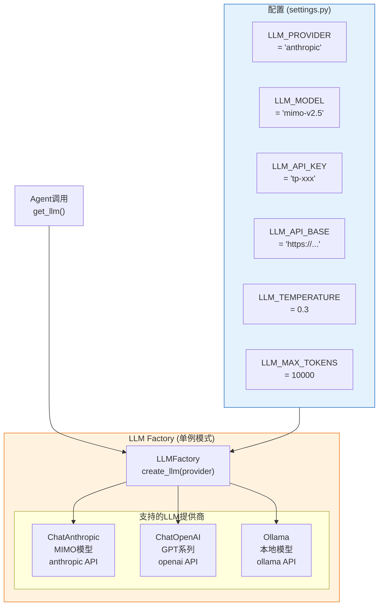
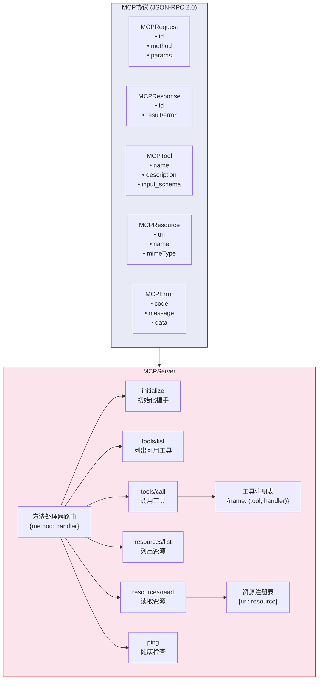
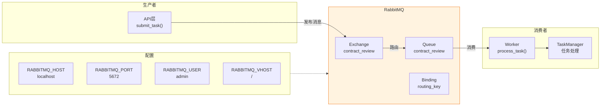
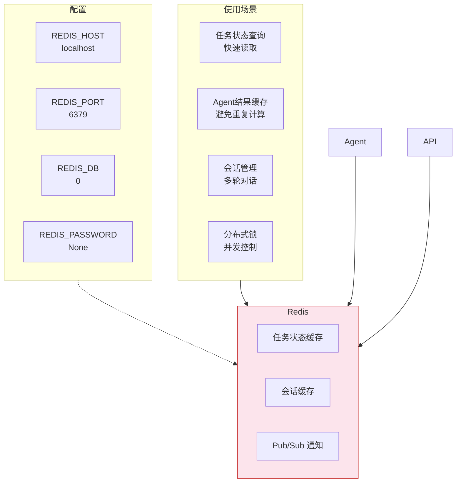
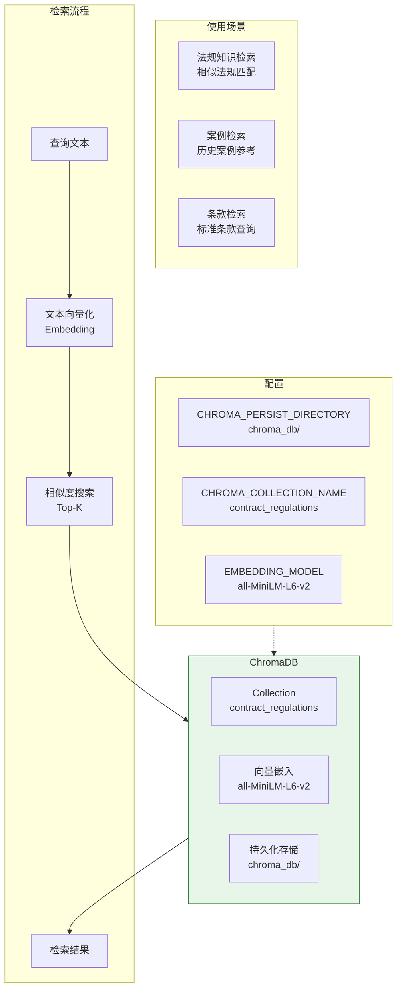
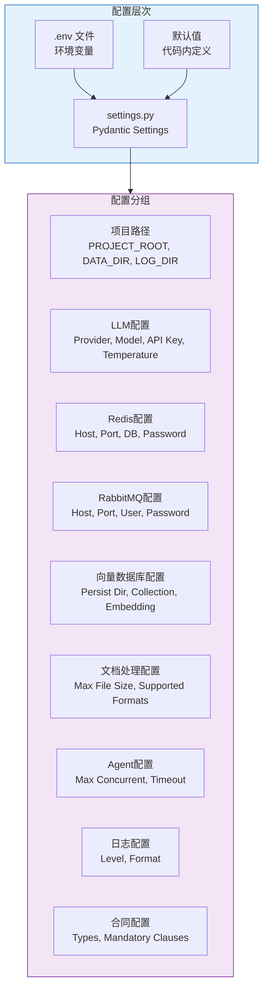
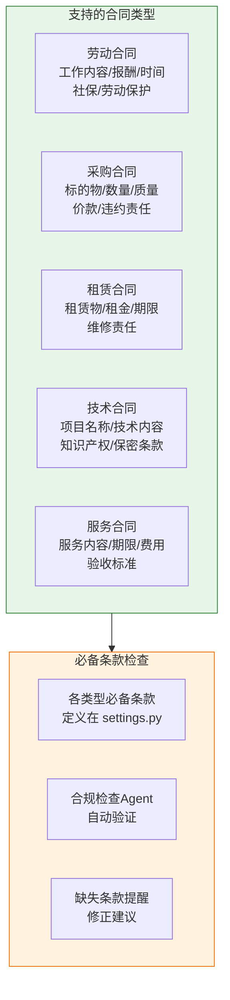
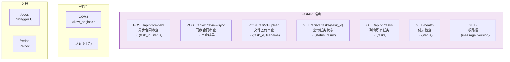
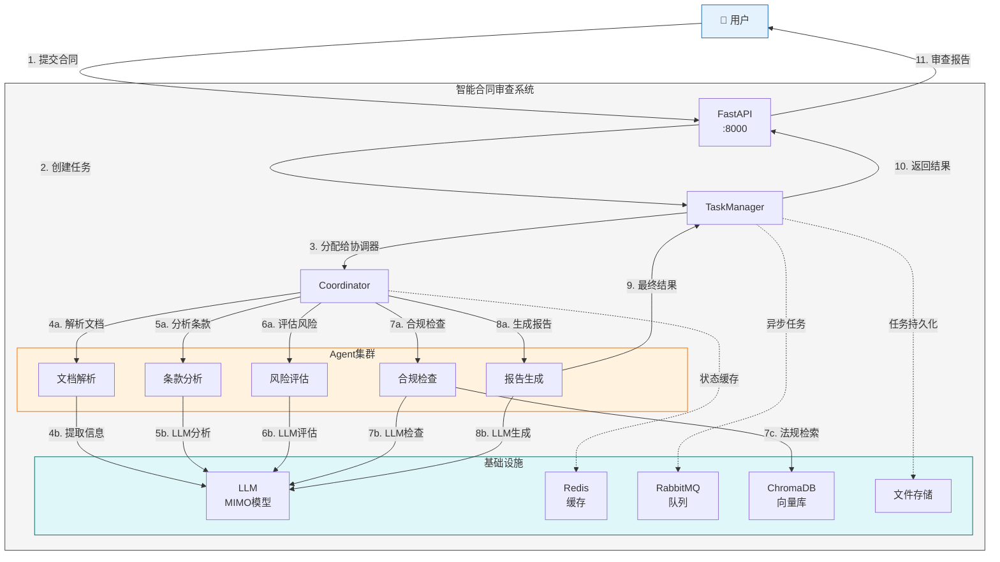

# 基础设施组件

## 1. LLM 工厂架构

```mermaid
graph TB
    subgraph LLMFactory["LLM Factory (单例模式)"]
        Factory["LLMFactory<br/>create_llm(provider)"]
        
        subgraph Providers["支持的LLM提供商"]
            Anthropic["ChatAnthropic<br/>MIMO模型<br/>anthropic API"]
            OpenAI["ChatOpenAI<br/>GPT系列<br/>openai API"]
            Ollama["Ollama<br/>本地模型<br/>ollama API"]
        end
    end

    subgraph Config["配置 (settings.py)"]
        Provider["LLM_PROVIDER<br/>= 'anthropic'"]
        Model["LLM_MODEL<br/>= 'mimo-v2.5'"]
        ApiKey["LLM_API_KEY<br/>= 'tp-xxx'"]
        ApiBase["LLM_API_BASE<br/>= 'https://...'"]
        Temp["LLM_TEMPERATURE<br/>= 0.3"]
        MaxTokens["LLM_MAX_TOKENS<br/>= 10000"]
    end

    Config --> Factory
    Factory --> Anthropic
    Factory --> OpenAI
    Factory --> Ollama

    Agent["Agent调用<br/>get_llm()"] --> Factory

    style LLMFactory fill:#fff3e0,stroke:#ef6c00
    style Config fill:#e3f2fd,stroke:#1565c0
```

## 2. MCP Server 架构

```mermaid
graph TB
    subgraph MCPServer["MCPServer"]
        Init["initialize<br/>初始化握手"]
        ToolsList["tools/list<br/>列出可用工具"]
        ToolsCall["tools/call<br/>调用工具"]
        ResList["resources/list<br/>列出资源"]
        ResRead["resources/read<br/>读取资源"]
        Ping["ping<br/>健康检查"]
        
        Handlers["方法处理器路由<br/>{method: handler}"]
        
        ToolsReg["工具注册表<br/>{name: (tool, handler)}"]
        ResReg["资源注册表<br/>{uri: resource}"]
    end

    subgraph Protocol["MCP协议 (JSON-RPC 2.0)"]
        MCPReq["MCPRequest<br/>• id<br/>• method<br/>• params"]
        MCPResp["MCPResponse<br/>• id<br/>• result/error"]
        MCPTool["MCPTool<br/>• name<br/>• description<br/>• input_schema"]
        MCPRes["MCPResource<br/>• uri<br/>• name<br/>• mimeType"]
        MCPError["MCPError<br/>• code<br/>• message<br/>• data"]
    end

    Handlers --> Init
    Handlers --> ToolsList
    Handlers --> ToolsCall
    Handlers --> ResList
    Handlers --> ResRead
    Handlers --> Ping

    ToolsCall --> ToolsReg
    ResRead --> ResReg

    Protocol --> MCPServer

    style MCPServer fill:#fce4ec,stroke:#c62828
    style Protocol fill:#e8eaf6,stroke:#283593
```

## 3. 消息队列 (RabbitMQ)

```mermaid
graph LR
    subgraph Producers["生产者"]
        API["API层<br/>submit_task()"]
    end

    subgraph RabbitMQ["RabbitMQ"]
        Exchange["Exchange<br/>contract_review"]
        Queue["Queue<br/>contract_review"]
        Binding["Binding<br/>routing_key"]
    end

    subgraph Consumers["消费者"]
        Worker["Worker<br/>process_task()"]
        TM["TaskManager<br/>任务处理"]
    end

    subgraph Config["配置"]
        Host["RABBITMQ_HOST<br/>localhost"]
        Port["RABBITMQ_PORT<br/>5672"]
        User["RABBITMQ_USER<br/>admin"]
        VHost["RABBITMQ_VHOST<br/>/"]
    end

    API -->|"发布消息"| Exchange
    Exchange -->|"路由"| Queue
    Queue -->|"消费"| Worker
    Worker --> TM
    Config -.-> RabbitMQ

    style RabbitMQ fill:#fff3e0,stroke:#ef6c00
```

## 4. 缓存层 (Redis)

```mermaid
graph TB
    subgraph Redis["Redis"]
        Cache["任务状态缓存"]
        Session["会话缓存"]
        PubSub["Pub/Sub 通知"]
    end

    subgraph Usage["使用场景"]
        T1["任务状态查询<br/>快速读取"]
        T2["Agent结果缓存<br/>避免重复计算"]
        T3["会话管理<br/>多轮对话"]
        T4["分布式锁<br/>并发控制"]
    end

    subgraph Config["配置"]
        RH["REDIS_HOST<br/>localhost"]
        RP["REDIS_PORT<br/>6379"]
        RD["REDIS_DB<br/>0"]
        RPW["REDIS_PASSWORD<br/>None"]
    end

    Config -.-> Redis
    Usage --> Redis

    Agent["Agent"] --> Redis
    API["API"] --> Redis

    style Redis fill:#fce4ec,stroke:#c62828
```

## 5. 向量数据库 (ChromaDB)

```mermaid
graph TB
    subgraph ChromaDB["ChromaDB"]
        Collection["Collection<br/>contract_regulations"]
        Embeddings["向量嵌入<br/>all-MiniLM-L6-v2"]
        Persist["持久化存储<br/>chroma_db/"]
    end

    subgraph Usage["使用场景"]
        R1["法规知识检索<br/>相似法规匹配"]
        R2["案例检索<br/>历史案例参考"]
        R3["条款检索<br/>标准条款查询"]
    end

    subgraph Flow["检索流程"]
        Query["查询文本"]
        Embed["文本向量化<br/>Embedding"]
        Search["相似度搜索<br/>Top-K"]
        Result["检索结果"]
    end

    Query --> Embed
    Embed --> Search
    Search --> ChromaDB
    ChromaDB --> Result

    subgraph Config["配置"]
        Dir["CHROMA_PERSIST_DIRECTORY<br/>chroma_db/"]
        Col["CHROMA_COLLECTION_NAME<br/>contract_regulations"]
        Model["EMBEDDING_MODEL<br/>all-MiniLM-L6-v2"]
    end

    Config -.-> ChromaDB

    style ChromaDB fill:#e8f5e9,stroke:#2e7d32
```

## 6. 配置管理

```mermaid
graph TB
    subgraph ConfigHierarchy["配置层次"]
        Env[".env 文件<br/>环境变量"]
        Settings["settings.py<br/>Pydantic Settings"]
        Defaults["默认值<br/>代码内定义"]
    end

    subgraph ConfigGroups["配置分组"]
        Project["项目路径<br/>PROJECT_ROOT, DATA_DIR, LOG_DIR"]
        LLM["LLM配置<br/>Provider, Model, API Key, Temperature"]
        RedisCfg["Redis配置<br/>Host, Port, DB, Password"]
        RabbitCfg["RabbitMQ配置<br/>Host, Port, User, Password"]
        VectorCfg["向量数据库配置<br/>Persist Dir, Collection, Embedding"]
        DocCfg["文档处理配置<br/>Max File Size, Supported Formats"]
        AgentCfg["Agent配置<br/>Max Concurrent, Timeout"]
        LogCfg["日志配置<br/>Level, Format"]
        ContractCfg["合同配置<br/>Types, Mandatory Clauses"]
    end

    Env --> Settings
    Defaults --> Settings
    Settings --> ConfigGroups

    style ConfigHierarchy fill:#e3f2fd,stroke:#1565c0
    style ConfigGroups fill:#f3e5f5,stroke:#7b1fa2
```

## 7. 支持的合同类型

```mermaid
graph TB
    subgraph ContractTypes["支持的合同类型"]
        Labor["劳动合同<br/>工作内容/报酬/时间<br/>社保/劳动保护"]
        Purchase["采购合同<br/>标的物/数量/质量<br/>价款/违约责任"]
        Lease["租赁合同<br/>租赁物/租金/期限<br/>维修责任"]
        Tech["技术合同<br/>项目名称/技术内容<br/>知识产权/保密条款"]
        Service["服务合同<br/>服务内容/期限/费用<br/>验收标准"]
    end

    subgraph MandatoryClauses["必备条款检查"]
        MC1["各类型必备条款<br/>定义在 settings.py"]
        MC2["合规检查Agent<br/>自动验证"]
        MC3["缺失条款提醒<br/>修正建议"]
    end

    ContractTypes --> MandatoryClauses

    style ContractTypes fill:#e8f5e9,stroke:#2e7d32
    style MandatoryClauses fill:#fff3e0,stroke:#ef6c00
```

## 8. API 端点

```mermaid
graph TB
    subgraph APIEndpoints["FastAPI 端点"]
        direction TB
        
        Post1["POST /api/v1/review<br/>异步合同审查<br/>→ {task_id, status}"]
        Post2["POST /api/v1/review/sync<br/>同步合同审查<br/>→ 审查结果"]
        Post3["POST /api/v1/upload<br/>文件上传审查<br/>→ {task_id, filename}"]
        Get1["GET /api/v1/tasks/{task_id}<br/>查询任务状态<br/>→ {status, result}"]
        Get2["GET /api/v1/tasks<br/>列出所有任务<br/>→ [tasks]"]
        Health["GET /health<br/>健康检查<br/>→ {status}"]
        Root["GET /<br/>根路径<br/>→ {message, version}"]
    end

    subgraph Middleware["中间件"]
        CORS["CORS<br/>allow_origins=*"]
        Auth["认证 (可选)"]
    end

    subgraph Docs["文档"]
        Swagger["/docs<br/>Swagger UI"]
        ReDoc["/redoc<br/>ReDoc"]
    end

    style APIEndpoints fill:#f3e5f5,stroke:#7b1fa2
```

## 9. 整体数据流图

```mermaid
graph TB
    User["👤 用户"]

    subgraph System["智能合同审查系统"]
        API["FastAPI<br/>:8000"]
        TM["TaskManager"]
        Coord["Coordinator"]
        
        subgraph Agents["Agent集群"]
            DocP["文档解析"]
            Clause["条款分析"]
            Risk["风险评估"]
            Comp["合规检查"]
            Report["报告生成"]
        end
        
        subgraph Infra["基础设施"]
            LLM["LLM<br/>MIMO模型"]
            Redis["Redis<br/>缓存"]
            RabbitMQ["RabbitMQ<br/>队列"]
            Chroma["ChromaDB<br/>向量库"]
            File["文件存储"]
        end
    end

    User -->|"1. 提交合同"| API
    API -->|"2. 创建任务"| TM
    TM -->|"3. 分配给协调器"| Coord
    
    Coord -->|"4a. 解析文档"| DocP
    DocP -->|"4b. 提取信息"| LLM
    
    Coord -->|"5a. 分析条款"| Clause
    Clause -->|"5b. LLM分析"| LLM
    
    Coord -->|"6a. 评估风险"| Risk
    Risk -->|"6b. LLM评估"| LLM
    
    Coord -->|"7a. 合规检查"| Comp
    Comp -->|"7b. LLM检查"| LLM
    Comp -->|"7c. 法规检索"| Chroma
    
    Coord -->|"8a. 生成报告"| Report
    Report -->|"8b. LLM生成"| LLM
    
    Report -->|"9. 最终结果"| TM
    TM -->|"10. 返回结果"| API
    API -->|"11. 审查报告"| User

    TM -.->|"异步任务"| RabbitMQ
    Coord -.->|"状态缓存"| Redis
    TM -.->|"任务持久化"| File

    style User fill:#e3f2fd,stroke:#1565c0
    style System fill:#f5f5f5,stroke:#424242
    style Agents fill:#fff3e0,stroke:#ef6c00
    style Infra fill:#e0f7fa,stroke:#00695c
```
