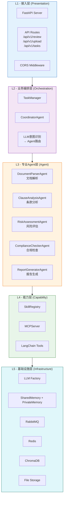
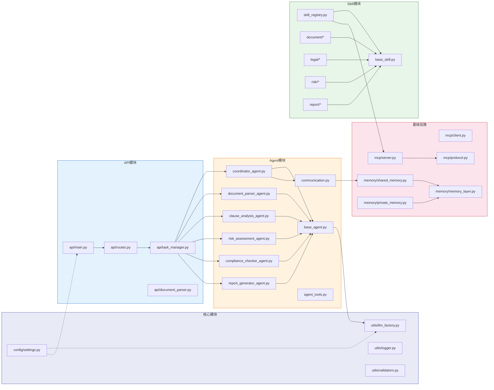
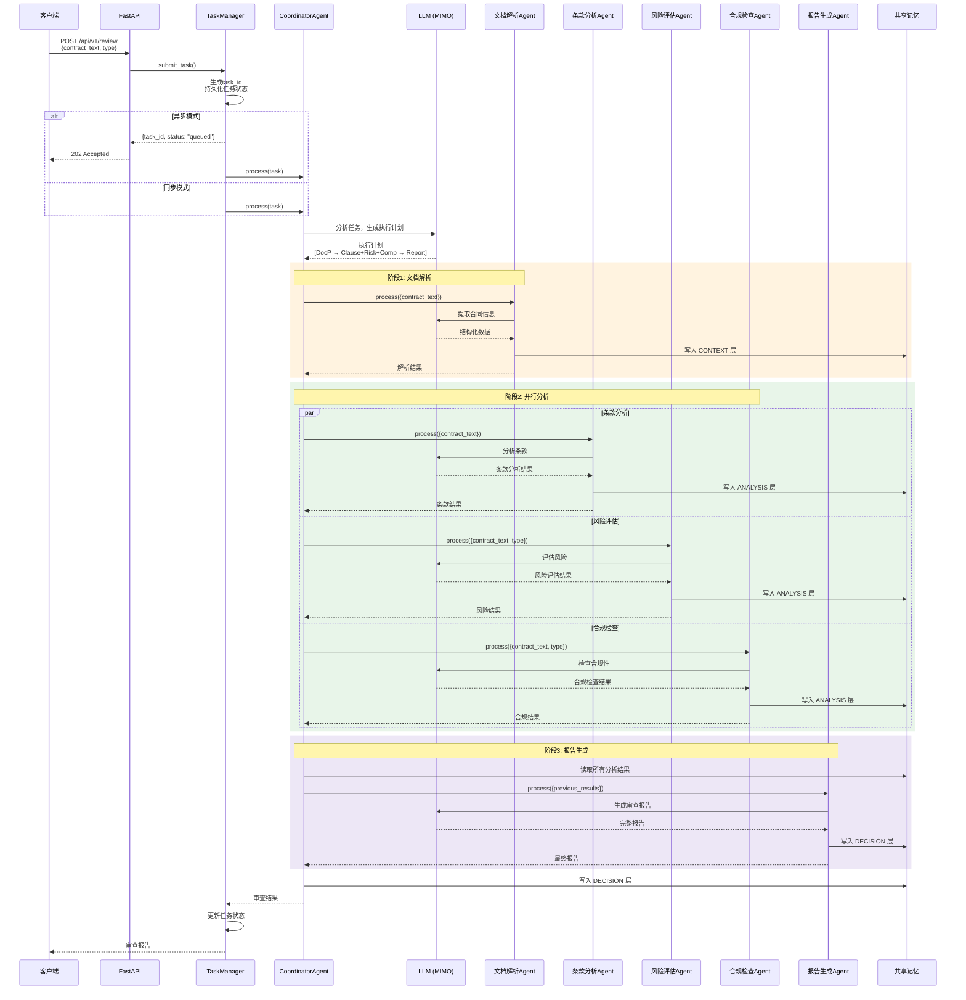
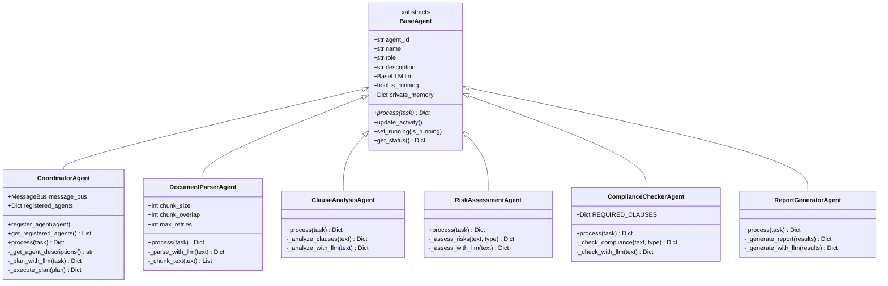
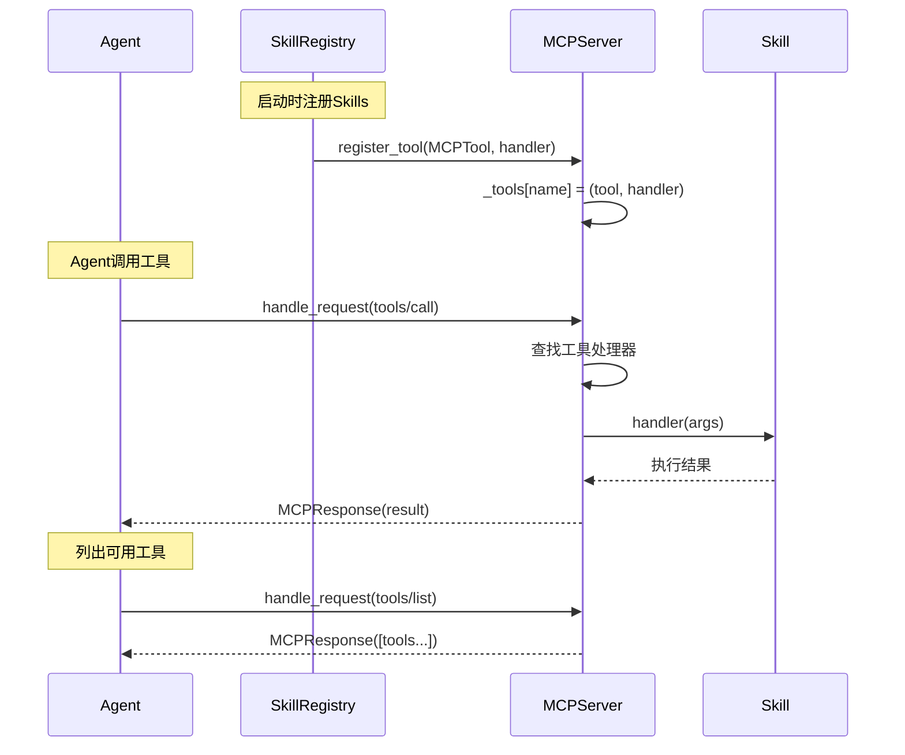

# 系统架构详解

## 1. 分层架构

```mermaid
graph TB
    subgraph L1["L1 - 接入层 (Presentation)"]
        API["FastAPI Server"]
        Routes["API Routes<br/>/api/v1/review<br/>/api/v1/upload<br/>/api/v1/tasks"]
        CORS["CORS Middleware"]
    end

    subgraph L2["L2 - 业务编排层 (Orchestration)"]
        TM["TaskManager"]
        Coord["CoordinatorAgent"]
        LLMRouter["LLM意图识别<br/>→ Agent路由"]
    end

    subgraph L3["L3 - 专业Agent层 (Agent)"]
        A1["DocumentParserAgent<br/>文档解析"]
        A2["ClauseAnalysisAgent<br/>条款分析"]
        A3["RiskAssessmentAgent<br/>风险评估"]
        A4["ComplianceCheckerAgent<br/>合规检查"]
        A5["ReportGeneratorAgent<br/>报告生成"]
    end

    subgraph L4["L4 - 能力层 (Capability)"]
        Skills["SkillRegistry"]
        MCP["MCPServer"]
        Tools["LangChain Tools"]
    end

    subgraph L5["L5 - 基础设施层 (Infrastructure)"]
        LLM["LLM Factory"]
        Mem["SharedMemory + PrivateMemory"]
        MQ["RabbitMQ"]
        Cache["Redis"]
        Vector["ChromaDB"]
        File["File Storage"]
    end

    L1 --> L2
    L2 --> L3
    L3 --> L4
    L4 --> L5

    style L1 fill:#e3f2fd,stroke:#1565c0
    style L2 fill:#f3e5f5,stroke:#7b1fa2
    style L3 fill:#fff3e0,stroke:#ef6c00
    style L4 fill:#e8f5e9,stroke:#2e7d32
    style L5 fill:#e0f7fa,stroke:#00695c
```

## 2. 模块依赖关系

```mermaid
graph LR
    subgraph 核心模块
        Settings["config/settings.py"]
        LLMFactory["utils/llm_factory.py"]
        Logger["utils/logger.py"]
        Validators["utils/validators.py"]
    end

    subgraph API模块
        Main["api/main.py"]
        Routes["api/routes.py"]
        TaskMgr["api/task_manager.py"]
        DocParserAPI["api/document_parser.py"]
    end

    subgraph Agent模块
        Base["base_agent.py"]
        Coord["coordinator_agent.py"]
        DocP["document_parser_agent.py"]
        Clause["clause_analysis_agent.py"]
        Risk["risk_assessment_agent.py"]
        Comp["compliance_checker_agent.py"]
        Report["report_generator_agent.py"]
        Comm["communication.py"]
        AgentTools["agent_tools.py"]
    end

    subgraph Skill模块
        BaseSkill["base_skill.py"]
        Reg["skill_registry.py"]
        DocSkills["document/*"]
        LegalSkills["legal/*"]
        RiskSkills["risk/*"]
        ReportSkills["report/*"]
    end

    subgraph 基础设施
        MCPServer["mcp/server.py"]
        MCPClient["mcp/client.py"]
        MCPProto["mcp/protocol.py"]
        SharedMem["memory/shared_memory.py"]
        PrivMem["memory/private_memory.py"]
        MemLayer["memory/memory_layer.py"]
    end

    %% 依赖关系
    Main --> Routes
    Routes --> TaskMgr
    TaskMgr --> Coord
    TaskMgr --> DocP
    TaskMgr --> Clause
    TaskMgr --> Risk
    TaskMgr --> Comp
    TaskMgr --> Report

    Coord --> Base
    DocP --> Base
    Clause --> Base
    Risk --> Base
    Comp --> Base
    Report --> Base
    
    Base --> LLMFactory
    Coord --> Comm
    Comm --> SharedMem

    Reg --> BaseSkill
    Reg --> MCPServer
    MCPServer --> MCPProto

    DocSkills --> BaseSkill
    LegalSkills --> BaseSkill
    RiskSkills --> BaseSkill
    ReportSkills --> BaseSkill

    SharedMem --> MemLayer
    PrivMem --> MemLayer

    Settings -.-> LLMFactory
    Settings -.-> Main

    style 核心模块 fill:#e8eaf6,stroke:#283593
    style API模块 fill:#e3f2fd,stroke:#1565c0
    style Agent模块 fill:#fff3e0,stroke:#ef6c00
    style Skill模块 fill:#e8f5e9,stroke:#2e7d32
    style 基础设施 fill:#fce4ec,stroke:#c62828
```

## 3. 请求处理流程

```mermaid
sequenceDiagram
    participant Client as 客户端
    participant API as FastAPI
    participant TM as TaskManager
    participant Coord as CoordinatorAgent
    participant LLM as LLM (MIMO)
    participant DocP as 文档解析Agent
    participant Clause as 条款分析Agent
    participant Risk as 风险评估Agent
    participant Comp as 合规检查Agent
    participant Report as 报告生成Agent
    participant Mem as 共享记忆

    Client->>API: POST /api/v1/review<br/>{contract_text, type}
    API->>TM: submit_task()
    TM->>TM: 生成task_id<br/>持久化任务状态

    alt 异步模式
        TM-->>API: {task_id, status: "queued"}
        API-->>Client: 202 Accepted
        TM->>Coord: process(task)
    else 同步模式
        TM->>Coord: process(task)
    end

    Coord->>LLM: 分析任务，生成执行计划
    LLM-->>Coord: 执行计划<br/>[DocP → Clause+Risk+Comp → Report]

    rect rgb(255, 243, 224)
        Note over Coord,DocP: 阶段1: 文档解析
        Coord->>DocP: process({contract_text})
        DocP->>LLM: 提取合同信息
        LLM-->>DocP: 结构化数据
        DocP->>Mem: 写入 CONTEXT 层
        DocP-->>Coord: 解析结果
    end

    rect rgb(232, 245, 233)
        Note over Coord,Comp: 阶段2: 并行分析
        par 条款分析
            Coord->>Clause: process({contract_text})
            Clause->>LLM: 分析条款
            LLM-->>Clause: 条款分析结果
            Clause->>Mem: 写入 ANALYSIS 层
            Clause-->>Coord: 条款结果
        and 风险评估
            Coord->>Risk: process({contract_text, type})
            Risk->>LLM: 评估风险
            LLM-->>Risk: 风险评估结果
            Risk->>Mem: 写入 ANALYSIS 层
            Risk-->>Coord: 风险结果
        and 合规检查
            Coord->>Comp: process({contract_text, type})
            Comp->>LLM: 检查合规性
            LLM-->>Comp: 合规检查结果
            Comp->>Mem: 写入 ANALYSIS 层
            Comp-->>Coord: 合规结果
        end
    end

    rect rgb(237, 231, 246)
        Note over Coord,Report: 阶段3: 报告生成
        Coord->>Mem: 读取所有分析结果
        Coord->>Report: process({previous_results})
        Report->>LLM: 生成审查报告
        LLM-->>Report: 完整报告
        Report->>Mem: 写入 DECISION 层
        Report-->>Coord: 最终报告
    end

    Coord->>Mem: 写入 DECISION 层
    Coord-->>TM: 审查结果
    TM->>TM: 更新任务状态
    TM-->>Client: 审查报告
```

## 4. Agent继承体系

```mermaid
classDiagram
    class BaseAgent {
        <<abstract>>
        +str agent_id
        +str name
        +str role
        +str description
        +BaseLLM llm
        +bool is_running
        +Dict private_memory
        +process(task) Dict*
        +update_activity()
        +set_running(is_running)
        +get_status() Dict
    }

    class CoordinatorAgent {
        +MessageBus message_bus
        +Dict registered_agents
        +register_agent(agent)
        +get_registered_agents() List
        +process(task) Dict
        -_get_agent_descriptions() str
        -_plan_with_llm(task) Dict
        -_execute_plan(plan) Dict
    }

    class DocumentParserAgent {
        +int chunk_size
        +int chunk_overlap
        +int max_retries
        +process(task) Dict
        -_parse_with_llm(text) Dict
        -_chunk_text(text) List
    }

    class ClauseAnalysisAgent {
        +process(task) Dict
        -_analyze_clauses(text) Dict
        -_analyze_with_llm(text) Dict
    }

    class RiskAssessmentAgent {
        +process(task) Dict
        -_assess_risks(text, type) Dict
        -_assess_with_llm(text) Dict
    }

    class ComplianceCheckerAgent {
        +Dict REQUIRED_CLAUSES
        +process(task) Dict
        -_check_compliance(text, type) Dict
        -_check_with_llm(text) Dict
    }

    class ReportGeneratorAgent {
        +process(task) Dict
        -_generate_report(results) Dict
        -_generate_with_llm(results) Dict
    }

    BaseAgent <|-- CoordinatorAgent
    BaseAgent <|-- DocumentParserAgent
    BaseAgent <|-- ClauseAnalysisAgent
    BaseAgent <|-- RiskAssessmentAgent
    BaseAgent <|-- ComplianceCheckerAgent
    BaseAgent <|-- ReportGeneratorAgent
```

## 5. Skill继承体系

```mermaid
classDiagram
    class BaseSkill {
        <<abstract>>
        +str skill_id
        +str name
        +str description
        +str version
        +bool _is_enabled
        +execute(**kwargs) Dict*
        +get_info() Dict
        +enable()
        +disable()
    }

    class PDFReader {
        +execute(file_path) Dict
        -_read_pdf(path) str
    }

    class DOCXParser {
        +execute(file_path) Dict
        -_parse_docx(path) str
    }

    class OCRProcessor {
        +execute(file_path) Dict
        -_ocr_image(path) str
    }

    class ClauseParser {
        +execute(text) Dict
        -_parse_clauses(text) List
    }

    class RegulationChecker {
        +execute(text, type) Dict
        -_check_regulations(text) List
    }

    class CaseRetriever {
        +execute(query) Dict
        -_retrieve_cases(query) List
    }

    class RiskIdentifier {
        +execute(text) Dict
        -_identify_risks(text) List
    }

    class RiskScorer {
        +execute(risks) Dict
        -_score_risks(risks) List
    }

    class MitigationSuggester {
        +execute(risks) Dict
        -_suggest_mitigations(risks) List
    }

    class ReportGenerator {
        +execute(data) Dict
        -_generate_report(data) str
    }

    class Visualization {
        +execute(data) Dict
        -_create_charts(data) Dict
    }

    class Export {
        +execute(data, format) Dict
        -_export_report(data, format) bytes
    }

    BaseSkill <|-- PDFReader
    BaseSkill <|-- DOCXParser
    BaseSkill <|-- OCRProcessor
    BaseSkill <|-- ClauseParser
    BaseSkill <|-- RegulationChecker
    BaseSkill <|-- CaseRetriever
    BaseSkill <|-- RiskIdentifier
    BaseSkill <|-- RiskScorer
    BaseSkill <|-- MitigationSuggester
    BaseSkill <|-- ReportGenerator
    BaseSkill <|-- Visualization
    BaseSkill <|-- Export
```

## 6. MCP协议交互

```mermaid
sequenceDiagram
    participant Agent as Agent
    participant Reg as SkillRegistry
    participant MCP as MCPServer
    participant Skill as Skill

    Note over Reg: 启动时注册Skills
    Reg->>MCP: register_tool(MCPTool, handler)
    MCP->>MCP: _tools[name] = (tool, handler)

    Note over Agent: Agent调用工具
    Agent->>MCP: handle_request(tools/call)
    MCP->>MCP: 查找工具处理器
    MCP->>Skill: handler(args)
    Skill-->>MCP: 执行结果
    MCP-->>Agent: MCPResponse(result)

    Note over Agent: 列出可用工具
    Agent->>MCP: handle_request(tools/list)
    MCP-->>Agent: MCPResponse([tools...])
```

## 7. 目录结构映射

```mermaid
graph TB
    Root["contract-review-system/"]
    
    Root --> Config["config/"]
    Config --> Settings["settings.py<br/>应用配置"]
    
    Root --> Src["src/"]
    
    Src --> Agents["agents/"]
    Agents --> Base["base_agent.py<br/>Agent基类"]
    Agents --> Coord["coordinator_agent.py<br/>协调器"]
    Agents --> DocP["document_parser_agent.py"]
    Agents --> Clause["clause_analysis_agent.py"]
    Agents --> Risk["risk_assessment_agent.py"]
    Agents --> Comp["compliance_checker_agent.py"]
    Agents --> Report["report_generator_agent.py"]
    Agents --> Comm["communication.py<br/>消息总线"]
    Agents --> Tools["agent_tools.py"]
    
    Src --> Api["api/"]
    Api --> Main["main.py<br/>FastAPI入口"]
    Api --> Routes["routes.py<br/>API路由"]
    Api --> TaskMgr["task_manager.py<br/>任务管理"]
    Api --> DocParser["document_parser.py<br/>文档解析"]
    
    Src --> Mcp["mcp/"]
    Mcp --> MCPServer["server.py<br/>MCP服务端"]
    Mcp --> MCPClient["client.py<br/>MCP客户端"]
    Mcp --> Protocol["protocol.py<br/>协议定义"]
    
    Src --> Memory["memory/"]
    Memory --> Shared["shared_memory.py<br/>共享记忆"]
    Memory --> Private["private_memory.py<br/>私有记忆"]
    Memory --> Layer["memory_layer.py<br/>记忆层次"]
    
    Src --> Skills["skills/"]
    Skills --> BaseSkill["base_skill.py<br/>Skill基类"]
    Skills --> Registry["skill_registry.py<br/>注册器"]
    Skills --> DocSkills["document/<br/>PDF/DOCX/OCR"]
    Skills --> LegalSkills["legal/<br/>条款/法规/案例"]
    Skills --> RiskSkills["risk/<br/>识别/评分/缓解"]
    Skills --> ReportSkills["report/<br/>生成/可视化/导出"]
    
    Src --> ToolsDir["tools/"]
    ToolsDir --> LCTools["langchain_tools.py"]
    
    Src --> Utils["utils/"]
    Utils --> LLMFactory["llm_factory.py<br/>LLM工厂"]
    Utils --> Logger["logger.py<br/>日志"]
    Utils --> Validators["validators.py<br/>验证器"]
    
    Src --> Workflow["workflow/"]
    
    Root --> Data["data/"]
    Data --> Samples["samples/<br/>合同样本"]
    Data --> Tasks["tasks/<br/>任务持久化"]
    
    Root --> Tests["tests/"]
    Tests --> Unit["unit/"]
    Tests --> Integration["integration/"]
    
    Root --> Docs["docs/"]
    Root --> Prompts["prompts/"]
    Root --> Arch["architecture/<br/>本目录"]

    style Root fill:#f5f5f5,stroke:#424242
    style Src fill:#e3f2fd,stroke:#1565c0
    style Agents fill:#fff3e0,stroke:#ef6c00
    style Api fill:#f3e5f5,stroke:#7b1fa2
    style Mcp fill:#fce4ec,stroke:#c62828
    style Memory fill:#ede7f6,stroke:#4527a0
    style Skills fill:#e8f5e9,stroke:#2e7d32
```
